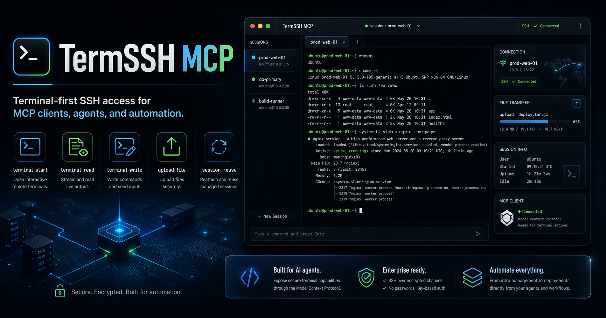
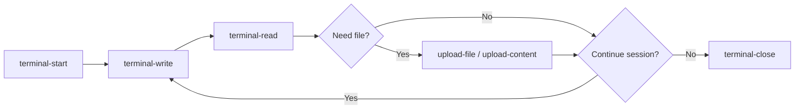

<p align="center">
  
</p>

<h1 align="center">TermSSH MCP</h1>

<p align="center">
  <strong>Terminal-first SSH access for MCP clients, AI agents, and remote automation.</strong>
</p>

<p align="center">
  Turn remote machines into agent-friendly, interactive terminal workflows — not just one-shot command execution.
</p>

<p align="center">
  <a href="https://github.com/rayss868/termssh-mcp"></a>
  
  
  
  <a href="LICENSE"></a>
</p>

---

## ✨ Why TermSSH MCP

Most SSH tooling for AI workflows is built around **run command → get output → done**.

That falls apart when the real task is interactive:
- installers ask questions
- shells keep state
- debugging needs multiple steps
- deployments need uploads plus terminal control
- agents need to observe, react, and continue

[`TermSSH MCP`](README.md) is built for that gap.

Instead of pretending everything is a single command, it gives MCP clients a real operator-style workflow:

> **open a shell → write input → read output → keep context → upload files → continue working**

---

## 🧠 What makes it different

<table>
<tr>
<td width="33%">

### Terminal-first
Interactive terminal sessions are the core model, not an afterthought.

</td>
<td width="33%">

### Agent-ready
Designed for MCP clients, coding agents, and automation loops.

</td>
<td width="33%">

### Stateful workflows
Reuse active sessions so multi-step tasks feel natural and reliable.

</td>
</tr>
<tr>
<td width="33%">

### Upload included
Move scripts, configs, payloads, and generated artifacts over SFTP.

</td>
<td width="33%">

### Cross-platform
Works against Linux and Windows SSH targets.

</td>
<td width="33%">

### Clean tool surface
Focused MCP tools for terminal control and remote file delivery.

</td>
</tr>
</table>

---

## 🚀 Core capabilities

- Interactive SSH terminal sessions
- Incremental terminal read / write flow
- Managed terminal session reuse by default
- Optional forced multi-session creation
- Local file upload through SFTP
- Direct text and base64 content upload
- Terminal resize support
- Linux and Windows SSH target support
- MCP-native interface for AI tooling

---

## 🧰 Tool set

### [`upload-file`](src/index.ts:105)
Upload a local file from the MCP host machine to the remote SSH server using SFTP.

**Parameters**
- `localPath` — local source file path
- `remotePath` — destination path on the remote host
- `createDirectories` — create missing parent directories if needed
- `overwrite` — replace an existing remote file if present
- `mode` — optional POSIX mode such as `0644`

### [`upload-content`](src/index.ts:122)
Upload direct text or base64 content to the remote server.

**Parameters**
- `content` — raw text or base64 payload
- `encoding` — `utf8` or `base64`
- `remotePath` — destination path on the remote host
- `createDirectories` — create missing parent directories if needed
- `overwrite` — replace an existing remote file if present
- `mode` — optional POSIX mode such as `0644`

### [`terminal-start`](src/index.ts:140)
Start an interactive remote terminal session.

**Parameters**
- `cwd` — optional working directory after shell startup
- `shell` — optional shell binary
- `platformHint` — `auto`, `linux`, or `windows`
- `elevated` — attempt `su` elevation when configured
- `cols` — terminal width
- `rows` — terminal height
- `env` — optional environment variables
- `multiSession` — set `true` to force a new managed session instead of reusing an existing one

### [`terminal-write`](src/index.ts:160)
Write input into an active terminal session.

**Parameters**
- `sessionId` — target session id
- `input` — text to send
- `appendNewline` — append a newline automatically if needed

### [`terminal-read`](src/index.ts:175)
Read buffered output from a terminal session.

**Parameters**
- `sessionId` — target session id
- `sinceSequence` — only return output newer than a given sequence number
- `maxChars` — limit the size of returned output
- `waitForMs` — optional short polling delay

### [`terminal-resize`](src/index.ts:194)
Resize an active terminal session.

**Parameters**
- `sessionId` — target session id
- `cols` — new width
- `rows` — new height

### [`terminal-close`](src/index.ts:209)
Close a terminal session locally.

**Parameters**
- `sessionId` — target session id

---

## 🔄 Typical workflow



This works especially well for:
- interactive package installs
- remote setup and provisioning
- deployments with artifact upload
- debugging services across multiple steps
- stateful shell workflows where context matters

---

## 🛠 Installation

### Clone the repository

```bash
git clone https://github.com/rayss868/termssh-mcp.git
cd termssh-mcp
npm install
npm run build
```

### Install globally

```bash
npm install -g termssh-mcp
```

---

## ⚙ Configuration

### Required CLI parameters
- `host` — hostname or IP address of the remote machine
- `user` — SSH username

### Optional CLI parameters
- `port` — SSH port, default `22`
- `password` — SSH password
- `key` — path to a private SSH key
- `sudoPassword` — optional password for sudo-oriented workflows
- `suPassword` — optional password for `su`-based elevation
- `timeout` — SSH ready timeout in milliseconds, default `60000`
- `maxChars` — command-length validation limit, default `1000`; use `none` or `0` for unlimited mode

---

## 🧩 MCP configuration example

```json
{
  "mcpServers": {
    "termssh-mcp": {
      "command": "npx",
      "args": [
        "-y",
        "termssh-mcp",
        "--",
        "--host=1.2.3.4",
        "--port=22",
        "--user=root",
        "--password=pass",
        "--timeout=30000",
        "--maxChars=none"
      ]
    }
  }
}
```

### SSH key example

```json
{
  "mcpServers": {
    "termssh-mcp": {
      "command": "npx",
      "args": [
        "-y",
        "termssh-mcp",
        "--",
        "--host=example.com",
        "--user=root",
        "--key=/path/to/private/key"
      ]
    }
  }
}
```

---

## 🤖 Claude Code example

Register the server in Claude Code:

```bash
claude mcp add --transport stdio termssh-mcp -- npx -y termssh-mcp -- --host=YOUR_HOST --user=YOUR_USER --password=YOUR_PASSWORD
```

With SSH key authentication:

```bash
claude mcp add --transport stdio termssh-mcp -- npx -y termssh-mcp -- --host=example.com --user=root --key=/path/to/private/key
```

With extended timeout:

```bash
claude mcp add --transport stdio termssh-mcp -- npx -y termssh-mcp -- --host=192.168.1.100 --user=admin --password=your_password --timeout=120000 --maxChars=none
```

---

## 🎯 Great fit for

<table>
<tr>
<td width="33%">

### Developers
- remote shell access from AI coding tools
- stateful debugging sessions
- script and config delivery

</td>
<td width="33%">

### DevOps / infra teams
- service inspection
- deployment support
- multi-step remote operations

</td>
<td width="33%">

### Agent builders
- terminal-native MCP workflows
- reusable sessions
- controlled remote automation loops

</td>
</tr>
</table>

---

## 🏗 Development

Build the project:

```bash
npm run build
```

Run tests:

```bash
npm test
```

Use the MCP Inspector:

```bash
npm run inspect
```

---

## 📁 Project structure

- [`src/index.ts`](src/index.ts:1) — MCP server entrypoint and tool registration
- [`src/ssh-connection-manager.ts`](src/ssh-connection-manager.ts:1) — SSH connection and terminal lifecycle handling
- [`src/upload.ts`](src/upload.ts:1) — upload helpers and interactive session metadata helpers
- [`src/core.ts`](src/core.ts:1) — shared validation and SSH utility primitives
- [`test/upload-and-terminal.test.ts`](test/upload-and-terminal.test.ts:1) — upload/session unit coverage
- [`test/maxChars.test.ts`](test/maxChars.test.ts:1) — command validation coverage
- [`test/smoke.ssh.test.ts`](test/smoke.ssh.test.ts:1) — smoke tests for current exported behavior

---

## 🗺 Roadmap ideas

- richer session metadata inspection
- better remote session observability
- optional session persistence features
- more examples for Claude Code and MCP tools
- deployment-oriented workflow templates

---

## 🔐 Security note

[`TermSSH MCP`](README.md) gives remote access to systems over SSH.
Use it only on infrastructure you own or are explicitly authorized to manage.

---

## 📜 License

Released under the [MIT License](LICENSE).

---

## 🤝 Contributing

Contributions are welcome.
See [`CONTRIBUTING.md`](CONTRIBUTING.md) for contribution guidance and [`CODE_OF_CONDUCT.md`](CODE_OF_CONDUCT.md) for expected behavior.